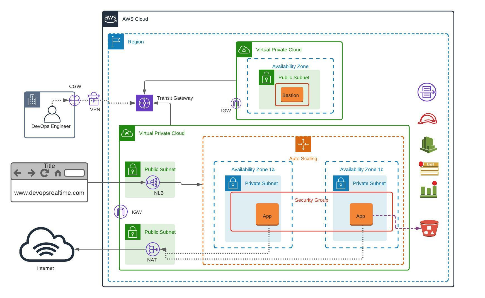

# 🚀 Scalable Multi-VPC Enterprise Architecture on AWS

## 📋 Project Overview
This project deploys a secure, highly available, and auto-scalable web application across multiple Virtual Private Clouds (VPCs). It simulates a real-world enterprise environment where production workloads are isolated from management networks.


**Key Features:**
* **Network Isolation:** Separate VPCs for Management (Bastion) and Production (App).
* **Centralized Connectivity:** AWS Transit Gateway connects isolated networks.
* **High Availability:** Auto Scaling Group spanning multiple Availability Zones.
* **Security:** Private subnets for application logic, strict Security Group chaining, and VPC Flow Logs for auditing.
* **Observability:** Custom CloudWatch metrics for memory usage.

---

## 🏗️ Architecture
The architecture consists of two VPCs connected via a Transit Gateway:

1.  **VPC A (Management):** Hosts a Bastion Server in a Public Subnet.
2.  **VPC B (Production):** Hosts the Application Load Balancer (Public) and App Servers (Private).

**Traffic Flow:**
* **Users** -> Application Load Balancer -> Auto Scaling Group (Private Subnets).
* **Admins** -> Bastion Host (VPC A) -> Transit Gateway -> App Servers (VPC B).
* **Outbound Updates** -> App Servers -> NAT Gateway -> Internet.


---

## 🛠️ Tech Stack
* **Cloud Provider:** AWS
* **Compute:** EC2 (Amazon Linux 2023), Auto Scaling Groups
* **Networking:** VPC, Transit Gateway, NAT Gateway, Application Load Balancer
* **Storage:** S3 (Artifact Store)
* **Monitoring:** CloudWatch (Logs & Metrics)
* **Web Server:** Apache HTTPD

---

## ⚙️ Implementation Phases

### Phase 1: The "Golden AMI"
Instead of configuring servers at runtime, I created a custom AMI pre-loaded with dependencies to speed up scaling.
* **Base OS:** Amazon Linux 2023
* **Installed:** Apache, Git, CloudWatch Agent.
* **Configuration:** Custom `memory_metrics.json` to track RAM usage (not tracked by AWS default metrics).

### Phase 2: Network Skeleton
Constructed the VPC environment:
* **VPC A (192.168.0.0/16):** 1 Public Subnet.
* **VPC B (172.32.0.0/16):** 2 Public Subnets (for ALB/NAT) and 2 Private Subnets (for App).
* **Transit Gateway:** Attached both VPCs to allow internal routing between Bastion and App servers.

### Phase 3: Routing & Security
Configured Route Tables to ensure strict traffic flow:
* **Private Subnets** route `0.0.0.0/0` to NAT Gateway (secure updates).
* **VPC Peering** traffic routes via Transit Gateway ID.
* **Security Groups:** Chained rules so App Servers only accept HTTP traffic from the Load Balancer and SSH traffic from the Bastion SG.

### Phase 4: Deployment & Scaling
* **Launch Template:** Configured with an IAM Role allowing S3 read access.
* **Auto Scaling Group (ASG):** Deployed across 2 Availability Zones for fault tolerance.
* **Application Load Balancer (ALB):** Routes external traffic to the private ASG instances.

---

## 🔧 Challenges & Troubleshooting (Lessons Learned)

During deployment, I encountered and solved several critical issues:

### 1. The "Network Load Balancer" Timeout
* **Issue:** Initially deployed a Network Load Balancer (NLB). The site timed out because NLBs preserve the client IP address. The private instances tried to reply directly to the client IP via the NAT Gateway (Asymmetric Routing), causing the packet to drop.
* **Solution:** Migrated to an **Application Load Balancer (ALB)**. The ALB acts as a proxy, ensuring symmetric routing and proper connection handling.

### 2. The 403 Forbidden Error
* **Issue:** The ALB Health Checks failed with a 403 error.
* **Diagnosis:** SSH'd via Bastion and discovered `/var/www/html` was empty. The User Data script failed to download code.
* **Root Cause:** The IAM Role had `s3:GetObject` but lacked `s3:ListBucket` permissions.
* **Fix:** Updated the IAM Policy to allow `s3:ListBucket` on the artifact bucket.

### 3. SSH Agent Forwarding
* **Issue:** Could not SSH from Bastion to Private Instances because the key pair was missing on the Bastion.
* **Solution:** Used SSH Agent Forwarding (`ssh -A`) and safely managed key permissions (`chmod 400`) on the Bastion host.

---

## 📜 Supporting Scripts

### User Data Script (Deployment)
```bash
#!/bin/bash
# Downloads web artifacts from S3 at launch
cd /var/www/html
aws s3 cp s3://YOUR-BUCKET-NAME/ . --recursive
systemctl restart httpd