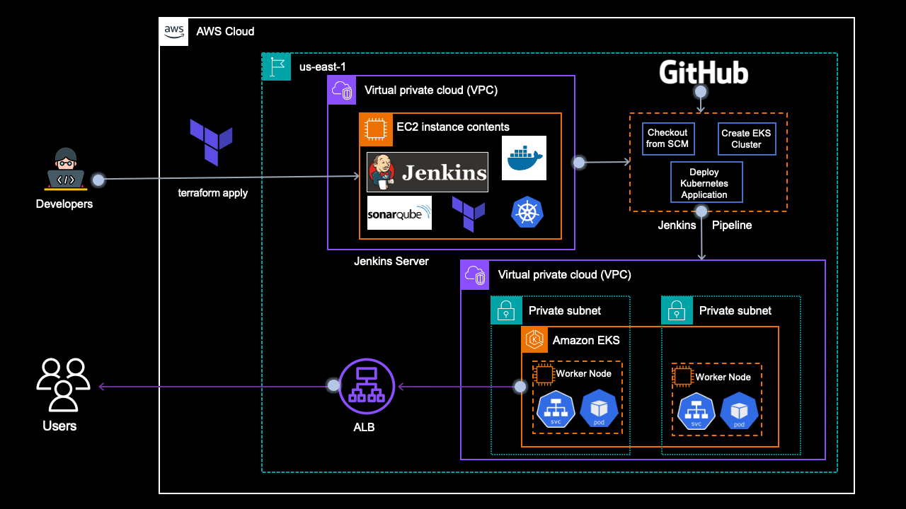

# From Scratch to Production: Deploying EKS Clusters and Applications with CI/CD using Jenkins and Terraform

## Streamlining EKS Deployment and CI/CD: A Step-by-Step Guide to Automating Application Delivery with Jenkins and Terraform

### Let's get started and explore the world of EKS, CI/CD, and automation

### **What we'll build**

We are going to build and deploy a lot of things. Here is the outline for our project:

**I. Setting up Jenkins Server with Terraform**

* Creating an EC2 instance with Terraform.

* Installing necessary tools: `Java, Jenkins, AWS CLI, Terraform CLI, Docker, Sonar, Helm, Trivy, Kubectl`.

* Configuring Jenkins server.

**II. Creating EKS Cluster with Terraform**

* Writing Terraform configuration files for `EKS` cluster creation in a private subnet.

* Deploying EKS cluster using Terraform.

**III. Deploying NGinx Application with Kubernetes**

* Writing Kubernetes manifest files `(YAML)` for the NGinx application.

* Deploying NGinx application to `EKS` cluster.

**IV. Automating Deployment with Jenkins CI/CD**

* Creating `Jenkins` pipeline for automating EKS cluster creation and Nginx application deployment.

* Integrating Terraform and Kubernetes with the Jenkins pipeline.

* Configuring continuous integration and deployment (CI/CD).

### **What we'll need**

To embark on our CI/CD adventure, we'll need a trusty toolkit:

**Terraform** — To create configuration files for the EC2 instance which will be used as a Jenkins server and EKS Cluster in a VPC.

**Shell Script —** To install command line tools in the EC2 instance.

**Jenkins file —** To create a pipeline in the Jenkins Server.

**Kubernetes Manifest files** — To create a simple NGINX application in the EKS cluster.

### **Source Code**

You can download the complete source code inside this repository.

