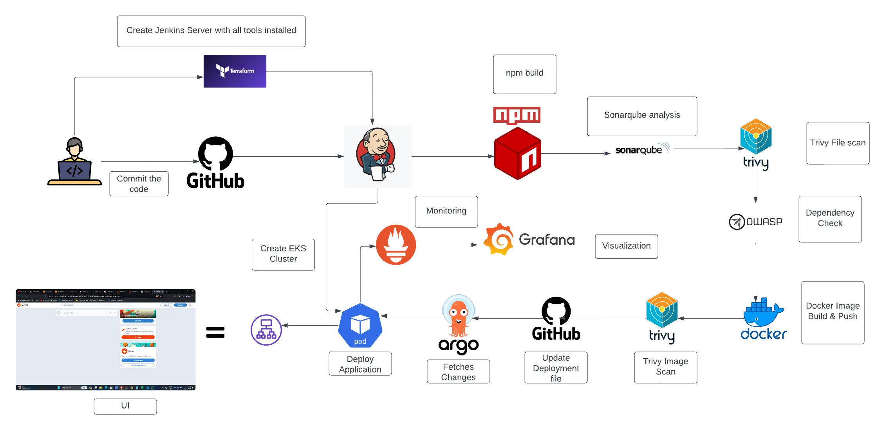

# Reddit Clone App on Kubernetes with Ingress
This project demonstrates how to deploy a Reddit clone app on Kubernetes with Ingress and expose it to the world using Minikube as the cluster.

## Prerequisites
Before you begin, you should have the following tools installed on your local machine: 

- Docker
- Kubeatm master and worker node
- kubectl
- Git

# 🚀 End-to-End DevSecOps K8s Project: Reddit Clone

## 📖 Project Overview
This project demonstrates a production-grade DevSecOps pipeline deployed on AWS Elastic Kubernetes Service (EKS). It automates the deployment of a full-stack Reddit Clone application using **Terraform** for Infrastructure as Code (IaC), **Jenkins** for Continuous Integration (CI) with embedded security scanning, and **ArgoCD** for GitOps-based Continuous Deployment (CD). 

The application is exposed to the internet via an **Nginx Ingress Controller** configured with custom DNS, CORS policies, and catch-all routing.

## 🏗️ Architecture Architecture

### 1. Infrastructure (IaC)
* **Terraform** is used to provision the AWS EKS cluster, VPC, subnets, and security groups.
* Ensures reproducible and version-controlled cloud infrastructure.

### 2. Continuous Integration (CI)
* **Jenkins** acts as the automation server.
* **SonarQube** performs static code analysis to enforce code quality.
* **Trivy** scans both the file system and the compiled Docker image for vulnerabilities ("Shifting Left").
* **Docker** builds and pushes the secure image to Docker Hub.

### 3. Continuous Deployment (GitOps)
* **ArgoCD** runs inside the EKS cluster.
* It continuously monitors the GitHub repository for changes to Kubernetes manifests.
* Automatically syncs and applies updates to the cluster, preventing configuration drift.

### 4. Networking & Monitoring
* **Nginx Ingress Controller** manages external access, routing traffic from an AWS Network Load Balancer to the application pods.
* **Prometheus & Grafana** provide real-time cluster monitoring and resource tracking.

## 🛠️ Tech Stack
* **Cloud Provider:** AWS (EKS, EC2, ELB, VPC, IAM)
* **Infrastructure as Code:** Terraform
* **Containerization:** Docker
* **Container Orchestration:** Kubernetes (K8s)
* **CI/CD:** Jenkins, ArgoCD
* **Security & Quality:** SonarQube, Trivy
* **Networking:** Nginx Ingress Controller, DNS
* **Monitoring:** Prometheus, Grafana, Helm

## 🚀 Getting Started
Please refer to the [INSTRUCTIONS.md](./INSTRUCTIONS.md) file for a detailed, step-by-step guide to deploying, configuring, and eventually tearing down this project.

## Installation
Follow these steps to install and run the Reddit clone app on your local machine:

1) Clone this repository to your local machine: `git clone https://github.com/LondheShubham153/reddit-clone-k8s-ingress.git`
2) Navigate to the project directory: `cd reddit-clone-k8s-ingress`
3) Build the Docker image for the Reddit clone app: `docker build -t reddit-clone-app .`
4) Deploy the app to Kubernetes: `kubectl apply -f deployment.yaml`
1) Deploy the Service for deployment to Kubernetes: `kubectl apply -f service.yaml`
5) Enable Ingress by using Command: `minikube addons enable ingress`
6) Expose the app as a Kubernetes service: `kubectl expose deployment reddit-deployment --type=NodePort --port=5000`
7) Create an Ingress resource: `kubectl apply -f ingress.yaml`

