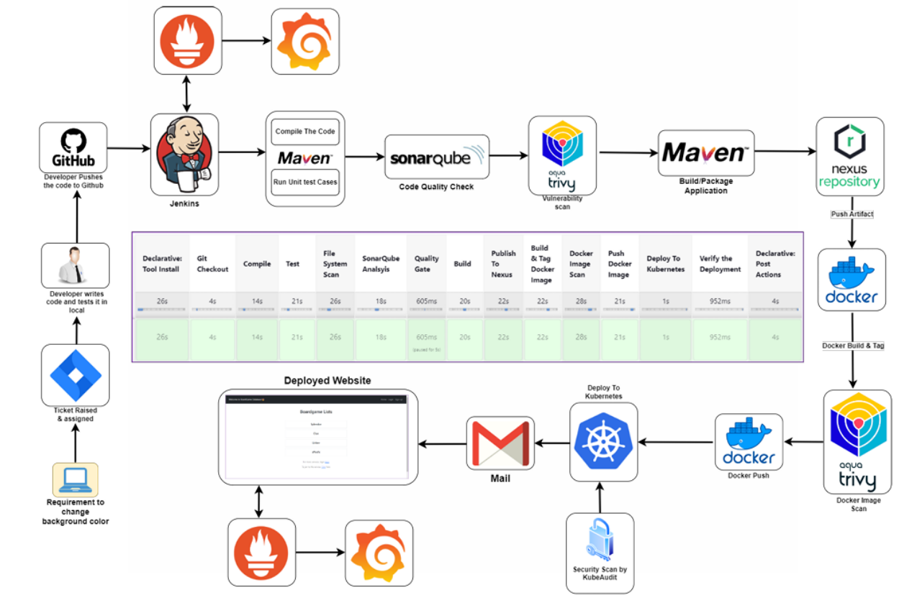

# AWS Kubernetes DevSecOps Pipeline


## 📖 Overview
This project is an end-to-end, fully automated **DevSecOps CI/CD Pipeline** deployed on **AWS**. It demonstrates the automated build, security scanning, and deployment of a containerized Java application onto a self-managed, 3-node Kubernetes cluster.

The infrastructure is decoupled across 7 independent EC2 instances to simulate an enterprise-grade, highly available environment. The pipeline enforces strict "Shift-Left" security practices, ensuring code quality and container security before deployment, while a custom observability stack tracks real-time application health.

## 🏗️ Architecture


**The Infrastructure Layer:**
* **Kubernetes Cluster:** 1 Master Node, 2 Worker Nodes (provisioned from scratch via `kubeadm`, CRI-O, and Calico).
* **Tooling Servers:** Dedicated EC2 instances for Jenkins, SonarQube, Nexus Repository, and Prometheus/Grafana monitoring.

## 🛠️ Technology Stack
| Category | Tool |
| :--- | :--- |
| **Cloud Provider** | AWS (EC2, VPC, Security Groups) |
| **Orchestration** | Kubernetes (`kubeadm`), Docker |
| **CI/CD Automation** | Jenkins (Declarative Pipeline) |
| **Build & Artifacts** | Maven, Sonatype Nexus |
| **Security & Quality** | SonarQube (SAST), Trivy (Vulnerability Scanning) |
| **Observability** | Prometheus, Grafana, Blackbox Exporter |

## 🔄 Pipeline Workflow
The automated Jenkins pipeline executes the following stages:
1.  **Checkout:** Pulls source code from the GitHub repository.
2.  **Compile & Test:** Builds the Java application and runs unit tests using Maven.
3.  **File System Scan:** Trivy scans the repository files for dependency vulnerabilities.
4.  **Static Code Analysis:** SonarQube analyzes code quality and enforces Quality Gates.
5.  **Artifact Publishing:** Pushes the compiled `.jar` artifact to the Nexus Repository.
6.  **Containerization:** Builds the Docker image using Eclipse Temurin JDK.
7.  **Image Security Scan:** Trivy scans the Docker image for CVEs.
8.  **Push to Registry:** Uploads the secure Docker image to Docker Hub.
9.  **Deploy:** Applies Kubernetes manifests to update the deployment on the Worker Nodes.

## 📊 Observability
A custom monitoring stack provides real-time visibility into application uptime:
* **Blackbox Exporter:** Probes the application's exposed `NodePort` endpoint.
* **Prometheus:** Scrapes metrics and uptime data every 15 seconds.
* **Grafana:** Visualizes the metrics through dynamic dashboards for instant health assessments.

---
### 👤 Author
**Saad Mohiuddin**


# Step-by-Step Implementation Guide

Follow these instructions to provision the infrastructure and configure the DevSecOps pipeline.

## 1. AWS Infrastructure Provisioning
Provision 7 Ubuntu 22.04 LTS EC2 instances in the same VPC and Security Group.

| Node Role | Instance Type | Storage |
| :--- | :--- | :--- |
| `K8s-Master` | `t2.medium` | 15 GB |
| `K8s-Worker-1` | `t2.medium` | 15 GB |
| `K8s-Worker-2` | `t2.medium` | 15 GB |
| `Jenkins-Server` | `t2.medium` | 15 GB |
| `SonarQube` | `t2.medium` | 15 GB |
| `Nexus` | `t2.medium` | 15 GB |
| `Monitoring` | `t2.micro` | 10 GB |

**Security Group Rules:**
Allow SSH (22), Kubernetes API (6443), NodePorts (30000-32767), and Tool Ports (8080, 8081, 9000, 9090, 3000). Allow "All Traffic" internally within the Security Group.

---

## 2. Kubernetes Cluster Setup (`kubeadm`)

### On Master & Worker Nodes:
1. Disable swap: `sudo swapoff -a`
2. Load kernel modules (`overlay`, `br_netfilter`) and set sysctl parameters for IPv4 forwarding.
3. Install CRI-O runtime and start the service.
4. Install `kubeadm`, `kubelet`, and `kubectl` (v1.29).

### On Master Node Only:
1. Initialize the cluster: 
   ```bash
   sudo kubeadm init --pod-network-cidr=192.168.0.0/16
Configure kubectl access for the local user.

Apply the Calico CNI plugin for pod networking.

Generate the join token: kubeadm token create --print-join-command

On Worker Nodes:
Execute the kubeadm join command generated by the Master node.

3. Tooling Configuration
Jenkins Server
Install OpenJDK 17.

Install Jenkins via the official Debian repository.

Install Docker and add the jenkins user to the docker group.

Install Trivy and kubectl CLI.

In Jenkins Dashboard, install required plugins (Docker Pipeline, SonarQube Scanner, Kubernetes CLI, Config File Provider).

SonarQube & Nexus (Dockerized)
Run the following on their respective EC2 instances after installing Docker:

SonarQube: docker run -d --name sonar -p 9000:9000 sonarqube:lts-community

Nexus: docker run -d --name nexus -p 8081:8081 sonatype/nexus3:latest

4. Pipeline Integration
Credentials: Add GitHub, Docker Hub, SonarQube Token, and the Kubernetes kubeconfig file to Jenkins global credentials.

Maven Settings: Create a global-settings file in Jenkins targeting the Nexus Private IP for artifact deployment.

POM & YAML: Update pom.xml with the Nexus Private IP. Ensure deployment-service.yaml uses lowercase image names and NodePort service type.

Execute: Run the Jenkins Declarative Pipeline.

5. Monitoring Stack
On the Monitoring EC2 instance:

Prometheus: Download the binary, configure prometheus.yml to scrape the Blackbox exporter, and run in the background.

Blackbox Exporter: Download and run the binary to ping the application's NodePort endpoint.

Grafana: Install via .deb package, start the service, and add Prometheus as a data source on port 9090. Create a dashboard using the probe_success query.


Would you like me to walk you through the Git commands to commit and push these new files up to your repository?